# ic内置lua教程

>不奇怪曾经说过: 呜呜

阅读本教程之前,请保证你已经学会触发器

<br>

## 如何开始使用ic内置lua

这个教程建立在你已经会使用触发器的基础上

相信你一定已经看到新建触发器时下面的`添加lua脚本`按钮了(没有的去更新新版本)

点击添加lua脚本 

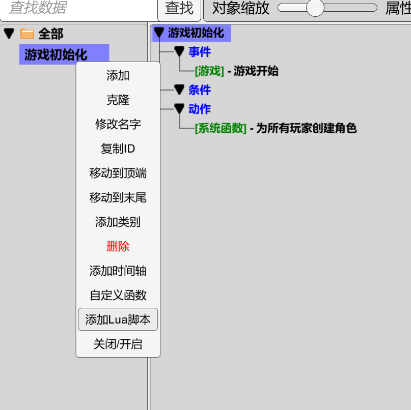

<br>

点击之后  就会出现我们的lua编写界面:

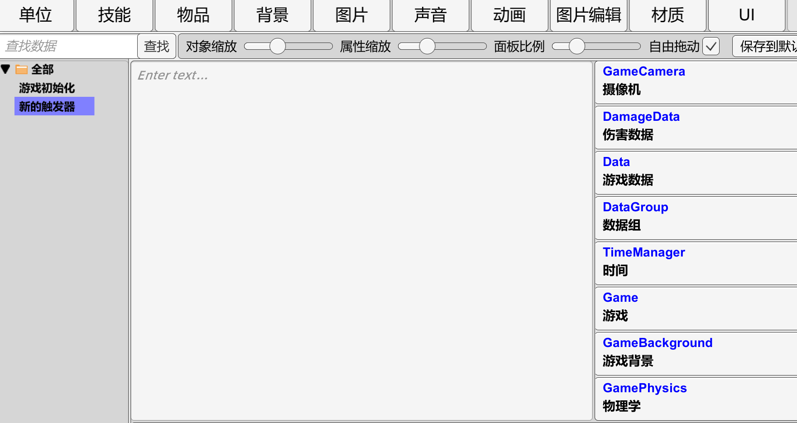

中间的地方就是我们的lua编写区域

右边的区域提供了当前能够使用的模块和函数信息, 在点击右边对应按钮时, 会自动补全按钮上的信息内容到lua编写区域

由于ic的自动补全机制 比较奇葩  我们先使用最简单的直接复制粘贴方式来进行lua代码编写

```lua
    UI_InfoPanel.AddInfo( "你好,ic", -1)
    -- 信息面板.添加一行信息 (内容, 持续时间)
```

将这句话直接复制到lua编写区域

然后, 在游戏初始化触发器里写上
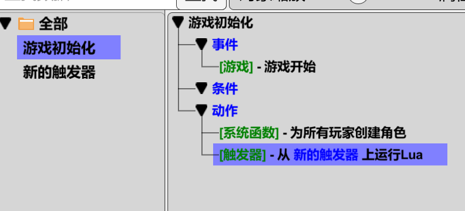

运行游戏
你将看到


>看不到的话点击信息面板上的两个按钮 把信息面板调成 全部 详细

这句lua和触发器里的信息面板函数功能是一样的, 只不过是换成了文本形式
```
 [信息面板] 为信息面板添加 hello, iclua 显示 -1 秒
```

事实上 lua和触发器的内容很多是一一对应的

可以看看lua和ic语句的对照

```lua
    --设置全局变量
    a = 1;
    -- [变量] 设置变量 整数 a = 1


    --设置局部变量
    local b = 2;
    -- [变量] 设置局部变量 整数 b = 2


    --条件分支
    if(a == 1) then
        UI_InfoPanel.AddInfo( "a 等于 1", -1)
    else
        UI_InfoPanel.AddInfo( "a 不等于 1", -1)
    end
    --[系统]-如果条件成立运行then否则运行else
    --   条件:
    --     [数学] 如果 (变量:a) == 1
    --   Then动作:
    --     [信息面板] 为信息面板添加 a 等于 1 显示 -1 秒
    --   Else动作:
    --     [信息面板] 为信息面板添加 a 不等于 1 显示 -1 秒


    --循环 
    for i = 0, 9 do
        UI_InfoPanel.AddInfo( i, -1)
    end
    --[系统]-For循环(使用变量i从下标0开始到下标10)
    --   动作:
    --     [信息面板] 为信息面板添加 (变量:i) 显示 -1 秒
```

注意lua虽然和触发器很像,但是还是有很多不同之处的

即使有不同之处, 将触发器的知识套用在lua上还是可以加快学习速度的


## 基础知识点

接下来 让我们来学习一遍lua知识点

### 全局变量
lua的全局变量使用方式和ic的全局变量基本相同

```lua
    --设置全局变量
    a = 1;
```

```lua
    --获取刚刚创建的全局变量, 可以在全局变量设置之后获取
    UI_InfoPanel.AddInfo( a , -1);
```

注意 : ic的变量和lua的变量是不互通的, 只能通过如下的(1)函数将ic变量添加到lua环境中, 或者根据(2)函数将变量从lua中取出

```
(1)
    [lua工具] -将变量名字为 a 类型为 整数 的 1 添加进lua

(2)
    变量参数: 
        [lua工具] 从Lua中获取名字为 a 的变量
```

```lua
    -- 在通过(1)函数将变量a添加到lua环境后  可以直接使用
    UI_InfoPanel.AddInfo( a , -1);

    -- lua环境中的变量可以直接由(2)函数获取
```

未声明过的变量的默认值为nil

将nil作为函数参数会导致报错


### 基础运算符

数值运算符号

`+` 使数字相加
`-` 使数字相减
`*` 使数字相乘
`/` 使数字相除
`%` 使数字取余
`^` 使数字取幂


lua的字符串使用 `..` 来链接

```lua
    a = "hello";
    b = "iclua";
    UI_InfoPanel.AddInfo( a .. b, -1);
    -- 为信息面板添加 hello iclua 显示 -1 秒
```


比较变量使用 `==` 和 `~=`

    ==  号表示等于
    ~=  号表示不等于
```lua
    -- 设置全局变量
    a = "笨蛋";
    b = 1;

    -- 比较
    a == "笨蛋"      -- 值为 true
    b == 2           -- 值为 false
    b ~= 2           -- 值为 true

```


### 条件分支
和ic的差不多

ic的条件可以塞很多行判断函数
而lua的只能在括号内写一个

```lua
    if(a == 1) then
        UI_InfoPanel.AddInfo( "a 等于 1", -1)
    end
    --[系统]-如果条件成立运行then否则运行else
    --   条件:
    --     [数学] 如果 (变量:a) == 1
    --   Then动作:
    --     [信息面板] 为信息面板添加 a 等于 1 显示 -1 秒
    --   Else动作:
```

如果要实现复杂条件判断:

`and`表示左右两边如果都满足条件 , 可以理解为ic触发器函数 :`[表达式] - 所有条件成立`

`or`表示左右两边只要有任意一个满足条件 , 可以理解为ic触发器函数 :`[表达式] - 任意条件成立`

```lua
    -- 判断左右都满足条件
    if(a == 1 and b == 2) then
        UI_InfoPanel.AddInfo( "a == 1 而且 b == 2", -1)
    end


    -- 判断多个条件满足
    if(a == 1 and b == 2 and c == 3) then
        UI_InfoPanel.AddInfo( "a == 1 , b == 2 , c == 3都成立", -1)
    end


    -- 判断左右只要有一个满足条件
    if(a == 1 or b == 2) then
        UI_InfoPanel.AddInfo( "a == 1 或者 b == 2", -1)
    end


    --复杂条件判断
    if(a == 1 and (b == 2 or c == 3)) then
        UI_InfoPanel.AddInfo( "a == 1 而且 b == 2 和 c == 3 任意一个成立", -1)
    end
```

如果没有 `Else动作` 那可以直接写end 将`else`省略不写

```lua
    if(a == 1) then
        UI_InfoPanel.AddInfo( "a 等于 1", -1)
    end
```

如果要进行多次条件判断, 可以直接写`else if`继续判断 

```lua
    if(a == 1) then
        UI_InfoPanel.AddInfo( "a 等于 1", -1)
    elseif(a == 2) then
        UI_InfoPanel.AddInfo( "a 等于 2", -1)
    else
        UI_InfoPanel.AddInfo( "a 不等于 1 和 2", -1)
    end
```

### for循环

和ic的差不多

```lua
    for i = 1, 10 do
        UI_InfoPanel.AddInfo( i, -1)
    end
    --[系统]-For循环(使用变量i从下标1开始到下标11)
    --   动作:
    --     [信息面板] 为信息面板添加 (变量:i) 显示 -1 秒
```

ic的for循环在即将循环到最后一个数时停下来, 而lua的for循环会循环到最后一个数


而且lua的for循环的变量是局部变量, 不能在for循环以外获取

除此以外  lua的for循环更加灵活

```lua
    --   i 从 10 逐渐变成 1  
    --   -1表示每次循环时 i 变化的值 
    for i = 10, 1 , -2 do
        UI_InfoPanel.AddInfo( i, -1)
    end
```

### 局部变量

局部变量只能在定义变量的代码块的区域使用

```lua
    if(true) then
        local a = 1;
        -- 可获取变量a的区域开始 --

        你的代码

        -- 可获取变量a的区域结束 --
    end
    -- 此处不可获取变量a --
```

注意lua的局部变量和ic的局部变量区别很大

(虽然ic基本没什么人用局部变量)

一般情况下 lua 优先使用局部变量  可以避免变量混乱问题

### 函数

和ic的自定义函数功能类似

默认是全局的自定义函数
定义后即可在任何地方调用
```lua
    -- a 和 b 为参数 
    function add(a, b)
        return a + b;   -- 返回 a + b 的值
    end

    -- 调用函数
    UI_InfoPanel.AddInfo( add(1, 2), -1)
```

另外  函数可以被当成参数传递
```lua

    -- a 和 b 为参数 
    function add(a, b)
        return a + b;   -- 返回 a + b 的值
    end

    function fun(a, b, f)
        return f(a, b);   -- 此处 add 被传进来作为 f 处理了 a 和 b 的计算
    end

    UI_InfoPanel.AddInfo( fun(1, 2, add), -1)

```

也可以省略函数名直接当参数传递
```lua

    function fun(a, b, f)
        return f(a, b);   -- 此处 add 被传进来作为 f 处理了 a 和 b 的计算
    end


    local n = fun(1, 2, function(a , b)
        return a + b;
    end)
    UI_InfoPanel.AddInfo( n , -1)

    --和上面的代码本质上相同  只不过把定义直接写在了参数的位置上
```


### 表

表是lua中非常重要的一个概念

表可以被作为数据组使用

注意 lua 中从 1 开始下标
```lua
    -- 定义一个表
    local a = {1, 2, 3, 4, 5}

    a[1] = 4 -- 设置下标为1的值为4

    UI_InfoPanel.AddInfo( a[1], -1) -- 获取下标的值
    UI_InfoPanel.AddInfo( a[2], -1)
    UI_InfoPanel.AddInfo( a[3], -1)

    table.insert(a, 6) -- 在表末尾添加一个 6

    table.insert(a, 2, 6) -- 在表的下标为2的位置插入一个6

    table.remove(a, 2) -- 删除下标为2的元素

    table.sort(a) -- 对表进行排序

```

表中可同时存在多种不同的数据
甚至可以套娃
```lua
    local a = {1, 2.0, "abc", true, {1,2,3}}
```

可以手动指定表中数据的名字
```lua
    local a = {name = "abc", age = 18}
    UI_InfoPanel.AddInfo( a.name, -1) -- 获取a中名字为name的值
    UI_InfoPanel.AddInfo( a.age, -1) -- 获取a中名字为age的值
```

可以通过以下方式遍历表中数据

ipairs只会遍历没有名字的数据

pairs会遍历所有数据
(有名字的数据 对应的下标会变成属性名的字符串)

`#a` 可获取表中没有名字的数据的个数

```lua
    local a = {1, 2, 3, num = 4, str = "abc"}

    for i, v in ipairs(a) do
        UI_InfoPanel.AddInfo( i, -1) -- 获取下标
        UI_InfoPanel.AddInfo( v, -1) -- 获取值
    end

    for i, v in pairs(a) do
        UI_InfoPanel.AddInfo( i, -1) -- 获取下标
        UI_InfoPanel.AddInfo( v, -1) -- 获取值
    end

    -- 直接使用普通for循环遍历  比较灵活
    for i = 1, #a do
        UI_InfoPanel.AddInfo( a[i], -1) 
    end
```

### 方法

表中可以存储函数  这种情况下函数也可以叫做方法

```lua
    local a = {1, 2, 3, num = 4, str = "abc", 
    fun = function()
        UI_InfoPanel.AddInfo( "调用函数", -1)
    end}

    a.fun() -- 调用函数
```

这种函数与普通的函数没有区别
使用时需要用  `表名.函数名()` 的形式调用


有一种特殊的函数
函数的第一个参数是 `self`
```lua
    local a = {
        name = "abc",
        fun = function(self , age)
            UI_InfoPanel.AddInfo( self.name .. "的年龄是" .. age, -1)
            -- abc的年龄是1
        end
    }

    a.fun(a , 1) -- 调用函数
```

这种函数在调用时需要传入表本身作为参数
通过这种方式访问到自身表的属性

由于书写不方便
以上调用方式可简写为

```lua
    a:fun(1) -- 调用函数
```

```lua
    --如果一个函数的调用方式是这样
    苹果.函数名(苹果)

    --那么这个函数可以简写为
    苹果:函数名()

    --绝大部分情况下都用第二种写法
```
ic的内置lua函数存在大量这种函数

有些函数应该使用 `:` 来访问  有些则使用 `.` 来访问


### 数学函数
lua有内置的数学函数

```lua
    UI_InfoPanel.AddInfo( math.abs(-1), -1) -- 绝对值
    UI_InfoPanel.AddInfo( math.ceil(1.2), -1) -- 向上取整
    UI_InfoPanel.AddInfo( math.floor(1.2), -1) -- 向下取整

    UI_InfoPanel.AddInfo( math.max(1, 2), -1) -- 获取最大值
    UI_InfoPanel.AddInfo( math.min(1, 2), -1) -- 获取最小值

    UI_InfoPanel.AddInfo( math.random(), -1) -- 获取0到1之间的随机数
    UI_InfoPanel.AddInfo( math.random(1, 10), -1) -- 获取1到10之间的随机数

    UI_InfoPanel.AddInfo( math.sqrt(4), -1) -- 获取平方根
```

### 其他知识

注释

```lua
    -- 单行注释
    --[[

    多行注释

    --]]
```


重命名一个函数

```lua

    local a = function()
        --函数内容
    end

    local b = a -- 重命名函数a为b

    b() -- 调用函数b  相当于直接调用a
```

## ic中的lua

### 使用自动补全查看ic函数

#### 自动补全函数
新建一个专门用来看自动补全的lua触发器
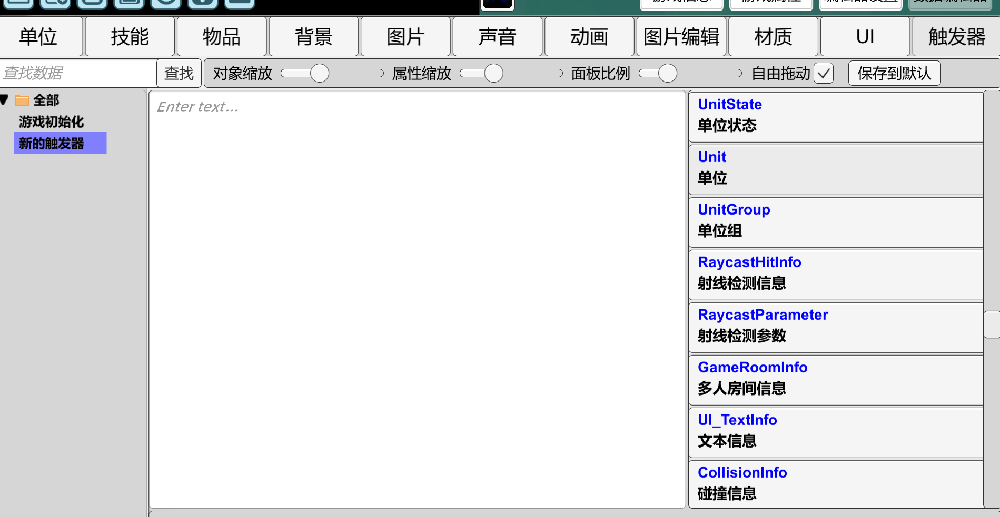

在右侧点你需要找的函数的分类

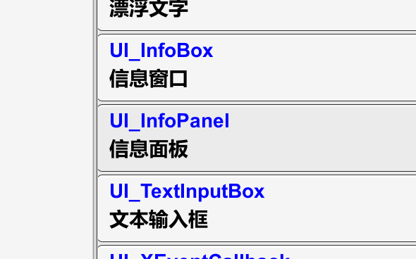

点击之后 ic会自动补全这个函数分类的英文名和一个英文标点

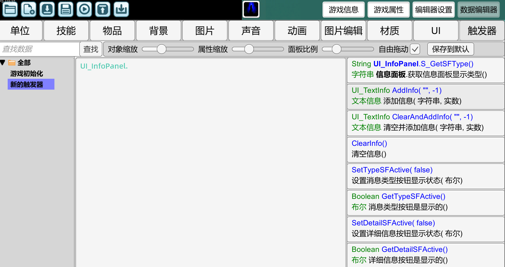

继续点击右边你需要的函数

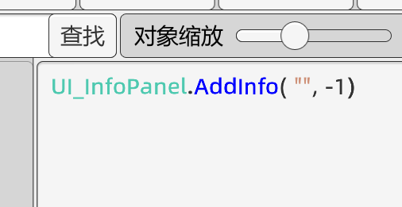

自动补全已经为我们补全了简单的调用格式

`""`是一个空字符串  我们可以将其改为我们想要的内容

第二个参数是这条信息的显示时间  暂时不用管

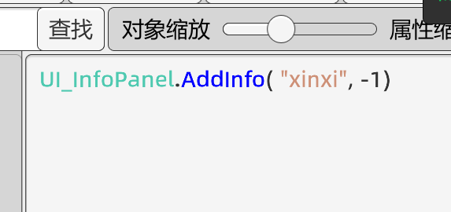

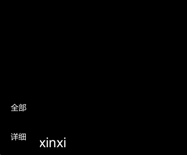

运行会打印函数

#### 更多补全函数和使用方式

当你想要找创建单位的函数

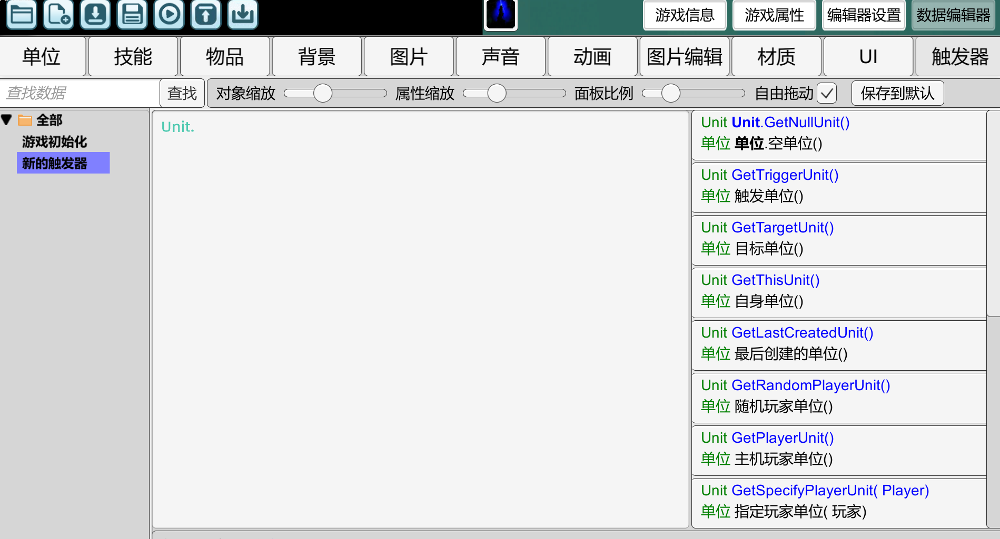

然后你会发现...  很多函数没有?

这是怎么回事呢

还记得我们之前提过lua函数的调用方式吗

```lua
    --如果一个函数的调用方式是这样
    表名.函数名(表名)

    --那么这个函数可以简写为
    表名:函数名()

```

很多函数需要 `:` 来访问  但是自动补全默认补全的是 `.`

所以自动补全只列出了需要 `.` 来访问的函数

把 `.` 改成 `:` 

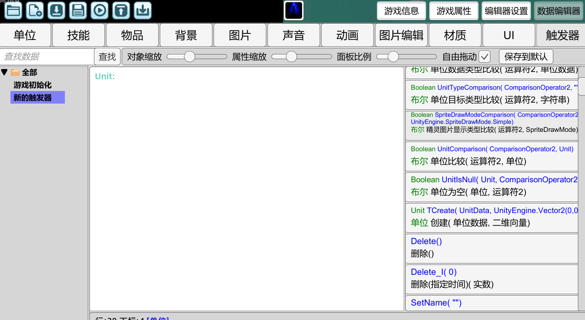

这样就可以看到大部分函数了

点击右侧的函数名 会自动补全到代码框中

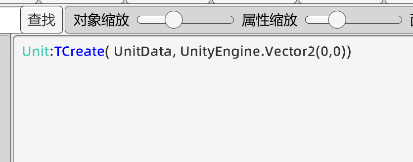

自动补全的是参数的类型 和简单的参数示例

由于lua中 获取单位数据类型比较麻烦  我们在ic触发器中添加进lua中

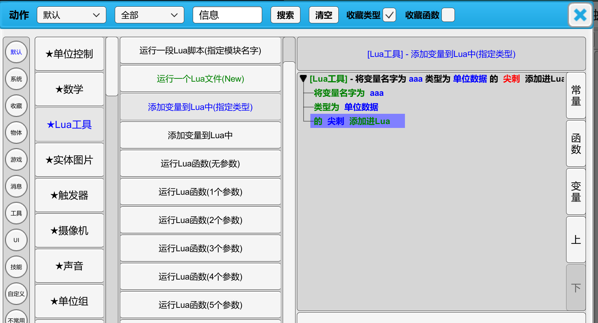

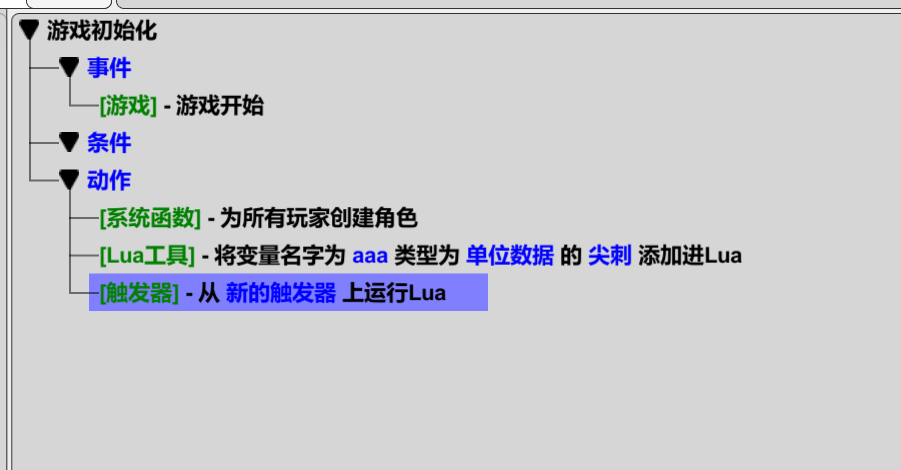

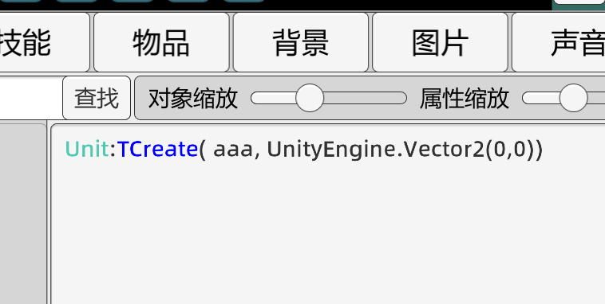

之后运行

报错了呢

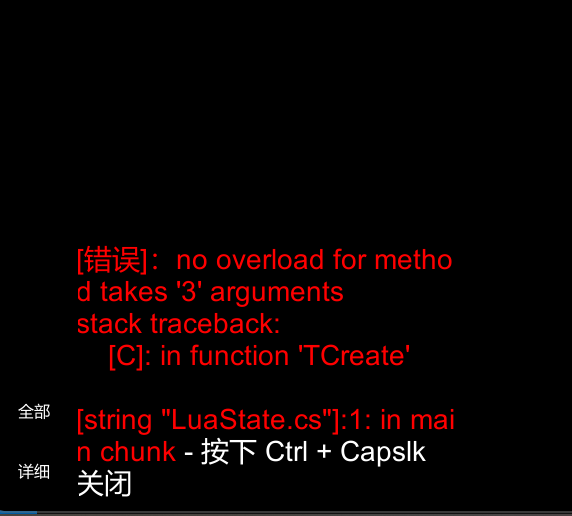

显示 我们为这个函数传递了三个参数
系统找不到对应三个参数的函数 就报错了

报错原因是

由于我们使用了`:`访问函数

这个调用方式实际上相当于写了

```lua
    Unit.TCreate(Unit, aaa, UnityEngine.Vector2(0,0))

```

我们传递了三个参数

实际上我们只需要两个参数

我们只需要把代码中的`:`改成`.`就可以了

>也就是说这个函数是需要用 . 访问的 但是想要自动补全出来是需要用 : 补全的  
>狠狠暴打aikesi

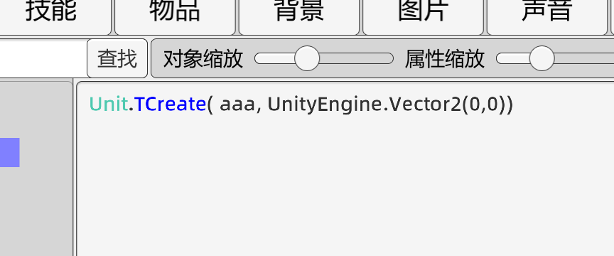

进入游戏  尖刺已经成功被创建了


`UnityEngine.Vector2(0,0)`是二维向量在lua的写法 两个0分别是x值和y值

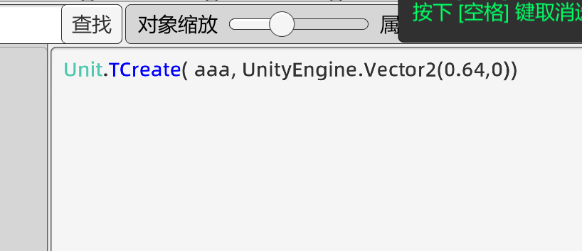
直接更改参数即可改变创建坐标

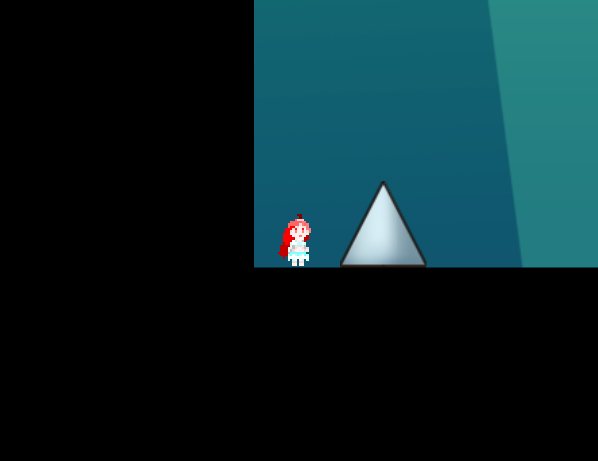
>水果可爱捏

#### lua使用技巧
可以用触发器直接将字符串作为lua执行
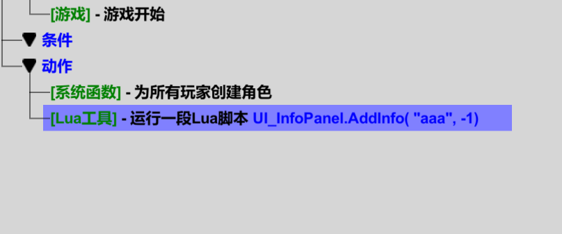


# 未完待续喵
