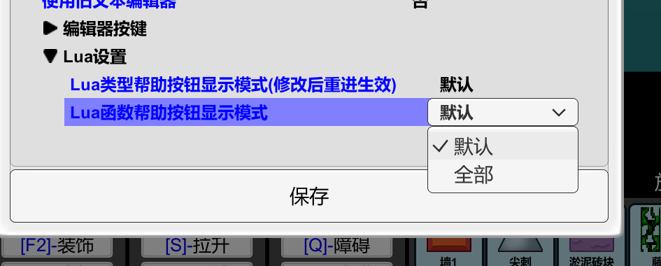

# ic内置lua教程


阅读本教程之前,请保证你已经学会触发器

<br>

## lua优点是什么? 什么情况下需要使用lua

lua运行速度极快  比触发器快了几百倍(保守估计)

相对于触发器 lua更加擅长编写复杂的逻辑 

如果你会用ai 可以让ai帮你编写一些小代码


lua可以调用更多的unity函数 可以做到触发器无法实现的事情

>用lua调用的unity3D

如果你需要: 
- 编写复杂的逻辑
- 调用更多的unity函数
- 想要更快的运行速度

那么请使用lua

## 如何开始使用ic内置lua

这个教程建立在你已经会使用触发器的基础上

相信你一定已经看到新建触发器时下面的`添加lua脚本`按钮了(没有的去更新新版本)

点击添加lua脚本 


<br>

点击之后  就会出现我们的lua编写界面:


中间的地方就是我们的lua编写区域

右边的区域提供了当前能够使用的模块和函数信息, 在点击右边对应按钮时, 会自动补全按钮上的信息内容到lua编写区域

由于ic的自动补全机制 比较奇葩  我们先使用最简单的直接复制粘贴方式来进行lua代码编写

```lua
    UI_InfoPanel.AddInfo( "你好,ic", -1)
    -- 信息面板.添加一行信息 (内容, 持续时间)
```

将这句话直接复制到lua编写区域

然后, 在游戏初始化触发器里写上


运行游戏
你将看到


>看不到的话点击信息面板上的两个按钮 把信息面板调成 全部 详细

这句lua和触发器里的信息面板函数功能是一样的, 只不过是换成了文本形式
```
 [信息面板] 为信息面板添加 hello, iclua 显示 -1 秒
```

事实上 lua和触发器的内容很多是一一对应的

可以看看lua和ic语句的对照

```lua
    --设置全局变量
    a = 1;
    -- [变量] 设置变量 整数 a = 1


    --设置局部变量
    local b = 2;
    -- [变量] 设置局部变量 整数 b = 2


    --条件分支
    if(a == 1) then
        UI_InfoPanel.AddInfo( "a 等于 1", -1)
    else
        UI_InfoPanel.AddInfo( "a 不等于 1", -1)
    end
    --[系统]-如果条件成立运行then否则运行else
    --   条件:
    --     [数学] 如果 (变量:a) == 1
    --   Then动作:
    --     [信息面板] 为信息面板添加 a 等于 1 显示 -1 秒
    --   Else动作:
    --     [信息面板] 为信息面板添加 a 不等于 1 显示 -1 秒


    --循环 
    for i = 0, 9 do
        UI_InfoPanel.AddInfo( i, -1)
    end
    --[系统]-For循环(使用变量i从下标0开始到下标10)
    --   动作:
    --     [信息面板] 为信息面板添加 (变量:i) 显示 -1 秒
```

注意lua虽然和触发器很像,但是还是有很多不同之处的

即使有不同之处, 将触发器的知识套用在lua上还是可以加快学习速度的


## 基础知识点

接下来 让我们来学习一遍lua知识点

### 全局变量
lua的全局变量使用方式和ic的全局变量基本相同

```lua
    --设置全局变量
    a = 1;
```

```lua
    --获取刚刚创建的全局变量, 可以在全局变量设置之后获取
    UI_InfoPanel.AddInfo( a , -1);
```

注意 : ic的变量和lua的变量是不互通的, 只能通过如下的(1)函数将ic变量添加到lua环境中, 或者根据(2)函数将变量从lua中取出

```
(1)
    [lua工具] -将变量名字为 a 类型为 整数 的 1 添加进lua

(2)
    点击 变量 找到: 
        [lua工具] 从Lua中获取名字为 a 的变量
```

新版本有更多方法进行交互, 可以自行探索

```lua
    -- 在通过(1)函数将变量a添加到lua环境后  可以直接使用
    UI_InfoPanel.AddInfo( a , -1);

    -- lua环境中的变量可以直接由(2)函数获取
```

未声明过的变量的默认值为nil

将nil作为函数参数会导致报错


### 基础运算符

数值运算符号

`+` 使数字相加
`-` 使数字相减
`*` 使数字相乘
`/` 使数字相除
`%` 使数字取余
`^` 使数字取幂


lua的字符串使用 `..` 来链接

```lua
    a = "hello";
    b = "iclua";
    UI_InfoPanel.AddInfo( a .. b, -1);
    -- 为信息面板添加 hello iclua 显示 -1 秒
```


比较变量使用 `==` 和 `~=`

    ==  号表示等于
    ~=  号表示不等于
```lua
    -- 设置全局变量
    a = "笨蛋";
    b = 1;

    -- 比较
    a == "笨蛋"      -- 值为 true
    b == 2           -- 值为 false
    b ~= 2           -- 值为 true

```


### 条件分支
和ic的差不多

ic的条件可以塞很多行判断函数
而lua的只能在括号内写一个

```lua
    if(a == 1) then
        UI_InfoPanel.AddInfo( "a 等于 1", -1)
    end
    --[系统]-如果条件成立运行then否则运行else
    --   条件:
    --     [数学] 如果 (变量:a) == 1
    --   Then动作:
    --     [信息面板] 为信息面板添加 a 等于 1 显示 -1 秒
    --   Else动作:
```

如果要实现复杂条件判断:

`and`表示左右两边如果都满足条件 , 可以理解为ic触发器函数 :`[表达式] - 所有条件成立`

`or`表示左右两边只要有任意一个满足条件 , 可以理解为ic触发器函数 :`[表达式] - 任意条件成立`

```lua
    -- 判断左右都满足条件
    if(a == 1 and b == 2) then
        UI_InfoPanel.AddInfo( "a == 1 而且 b == 2", -1)
    end


    -- 判断多个条件满足
    if(a == 1 and b == 2 and c == 3) then
        UI_InfoPanel.AddInfo( "a == 1 , b == 2 , c == 3都成立", -1)
    end


    -- 判断左右只要有一个满足条件
    if(a == 1 or b == 2) then
        UI_InfoPanel.AddInfo( "a == 1 或者 b == 2", -1)
    end


    --复杂条件判断
    if(a == 1 and (b == 2 or c == 3)) then
        UI_InfoPanel.AddInfo( "a == 1 而且 b == 2 和 c == 3 任意一个成立", -1)
    end
```

如果没有 `Else动作` 那可以直接写end 将`else`省略不写

```lua
    if(a == 1) then
        UI_InfoPanel.AddInfo( "a 等于 1", -1)
    end
```

如果要进行多次条件判断, 可以直接写`else if`继续判断 

```lua
    if(a == 1) then
        UI_InfoPanel.AddInfo( "a 等于 1", -1)
    elseif(a == 2) then
        UI_InfoPanel.AddInfo( "a 等于 2", -1)
    else
        UI_InfoPanel.AddInfo( "a 不等于 1 和 2", -1)
    end
```

### for循环

和ic的差不多

```lua
    for i = 1, 10 do
        UI_InfoPanel.AddInfo( i, -1)
    end
    --[系统]-For循环(使用变量i从下标1开始到下标11)
    --   动作:
    --     [信息面板] 为信息面板添加 (变量:i) 显示 -1 秒
```

ic的for循环在即将循环到最后一个数时停下来, 而lua的for循环会循环到最后一个数


而且lua的for循环的变量是局部变量, 不能在for循环以外获取

除此以外  lua的for循环更加灵活

```lua
    --   i 从 10 逐渐变成 1  
    --   -2表示每次循环时 i 变化的值 
    for i = 10, 1 , -2 do
        UI_InfoPanel.AddInfo( i, -1)
    end
```

### 局部变量

局部变量只能在定义变量的代码块的区域使用

```lua
    if(true) then
        local a = 1;
        -- 可获取变量a的区域开始 --

        你的代码

        -- 可获取变量a的区域结束 --
    end
    -- 此处不可获取变量a --
```

注意lua的局部变量和ic的局部变量区别很大

(虽然ic基本没什么人用局部变量)

一般情况下 lua 优先使用局部变量  可以避免变量混乱问题

### 函数

和ic的自定义函数功能类似 (仅仅是类似 lua的函数功能更强大)

默认是全局的自定义函数
定义后即可在任何地方调用
```lua
    -- a 和 b 为参数 
    function add(a, b)
        return a + b;   -- 返回 a + b 的值
    end

    -- 调用函数
    UI_InfoPanel.AddInfo( add(1, 2), -1)
```

另外  函数可以被当成参数传递
```lua

    -- a 和 b 为参数 
    function add(a, b)
        return a + b;   -- 返回 a + b 的值
    end

    function fun(a, b, f)
        return f(a, b);   -- 此处 add 被传进来作为 f 处理了 a 和 b 的计算
    end

    UI_InfoPanel.AddInfo( fun(1, 2, add), -1)

```

也可以省略函数名直接当参数传递
```lua

    function fun(a, b, f) --参数f为处理函数
        return f(a, b);   -- 此处 add 被传进来作为 f 处理了 a 和 b 的计算
    end


    local n = fun(1, 2, function(a , b)
        return a + b;
    end)
    UI_InfoPanel.AddInfo( n , -1)

    --和上面的代码本质上相同  只不过把定义直接写在了参数的位置上
```

lua的函数可以拥有多个返回值
```lua
    function fun(a, b)
        return a + b, a - b;   -- 返回 a + b 和 a - b 的值
    end

    local n1, n2 = fun(1, 2)
    -- n1和n2分别是两个返回值
```


### 表

表是lua中非常重要的一个概念

表可以被作为数据组使用

注意 lua 中从 1 开始下标
```lua
    -- 定义一个表
    local a = {1, 2, 3, 4, 5}

    a[1] = 4 -- 设置下标为1的值为4

    UI_InfoPanel.AddInfo( a[1], -1) -- 获取下标的值
    UI_InfoPanel.AddInfo( a[2], -1)
    UI_InfoPanel.AddInfo( a[3], -1)

    table.insert(a, 6) -- 在表末尾添加一个 6

    table.insert(a, 2, 6) -- 在表的下标为2的位置插入一个6

    table.remove(a, 2) -- 删除下标为2的元素

    table.sort(a) -- 对表进行排序

```

表中可同时存在多种不同的数据
甚至可以套娃
```lua
    local a = {1, 2.0, "abc", true, {1,2,3}}
```

可以手动指定表中数据的名字
```lua
    local a = {name = "abc", age = 18}
    UI_InfoPanel.AddInfo( a.name, -1) -- 获取a中名字为name的值
    UI_InfoPanel.AddInfo( a.age, -1) -- 获取a中名字为age的值
```

可以通过以下方式遍历表中数据

ipairs只会遍历没有名字的数据

pairs会遍历所有数据
(有名字的数据 对应的下标会变成属性名的字符串)

`#a` 可获取表中没有名字的数据的个数

```lua
    local a = {1, 2, 3, num = 4, str = "abc"}

    for i, v in ipairs(a) do
        UI_InfoPanel.AddInfo( i, -1) -- 获取下标
        UI_InfoPanel.AddInfo( v, -1) -- 获取值
    end

    for i, v in pairs(a) do
        UI_InfoPanel.AddInfo( i, -1) -- 获取下标
        UI_InfoPanel.AddInfo( v, -1) -- 获取值
    end

    -- 直接使用普通for循环遍历  比较灵活
    for i = 1, #a do
        UI_InfoPanel.AddInfo( a[i], -1) 
    end
```

### 方法

表中可以存储函数  这种情况下函数也可以叫做方法

```lua
    local a = {1, 2, 3, num = 4, str = "abc", 
    fun = function()
        UI_InfoPanel.AddInfo( "调用函数", -1)
    end}

    a.fun() -- 调用函数
```

这种函数与普通的函数没有区别
使用时需要用  `表名.函数名()` 的形式调用


有一种特殊的函数
函数的第一个参数是 `self`
```lua
    local a = {
        name = "abc",
        fun = function(self , age)
            UI_InfoPanel.AddInfo( self.name .. "的年龄是" .. age, -1)
            -- abc的年龄是1
        end
    }

    a.fun(a , 1) -- 调用函数
```

这种函数在调用时需要传入表本身作为参数
通过这种方式访问到自身表的属性

由于书写不方便
以上调用方式可简写为

```lua
    a:fun(1) -- 调用函数
```

```lua
    --如果一个函数的调用方式是这样
    苹果.函数名(苹果)

    --那么这个函数可以简写为
    苹果:函数名()

    --绝大部分情况下都用第二种写法
```
ic的内置lua函数存在大量这种函数

有些函数应该使用 `:` 来访问  有些则使用 `.` 来访问


### 数学函数
lua有内置的数学函数

```lua
    UI_InfoPanel.AddInfo( math.abs(-1), -1) -- 绝对值
    UI_InfoPanel.AddInfo( math.ceil(1.2), -1) -- 向上取整
    UI_InfoPanel.AddInfo( math.floor(1.2), -1) -- 向下取整

    UI_InfoPanel.AddInfo( math.max(1, 2), -1) -- 获取最大值
    UI_InfoPanel.AddInfo( math.min(1, 2), -1) -- 获取最小值

    UI_InfoPanel.AddInfo( math.random(), -1) -- 获取0到1之间的随机数
    UI_InfoPanel.AddInfo( math.random(1, 10), -1) -- 获取1到10之间的随机数

    UI_InfoPanel.AddInfo( math.sqrt(4), -1) -- 获取平方根
```

### 其他知识

注释

```lua
    -- 单行注释
    --[[

    多行注释

    --]]
```


获取函数的引用

```lua

    local a = function()
        --函数内容
    end

    local b = a -- 获取函数a的引用

    b() -- 调用函数b  相当于直接调用a
```

## ic中的lua

### 使用自动补全查看ic函数

#### 自动补全函数
新建一个专门用来看自动补全的lua触发器


在右侧点你需要找的函数的分类


点击之后 ic会自动补全这个函数分类的英文名和一个英文标点


继续点击右边你需要的函数


自动补全已经为我们补全了简单的调用格式

`""`是一个空字符串  我们可以将其改为我们想要的内容

第二个参数是这条信息的显示时间  暂时不用管


运行会打印函数

#### 更多补全函数和使用方式

当你想要找创建单位的函数


然后你会发现...  很多函数没有?

这是怎么回事呢

还记得我们之前提过lua函数的调用方式吗

```lua
    --如果一个函数的调用方式是这样
    表名.函数名(表名)

    --那么这个函数可以简写为
    表名:函数名()

```

很多函数需要 `:` 来访问  但是自动补全默认补全的是 `.`

所以自动补全只列出了需要 `.` 来访问的函数

把 `.` 改成 `:` 


这样就可以看到大部分函数了

点击右侧的函数名 会自动补全到代码框中


自动补全的是参数的类型 和简单的参数示例

由于lua中 获取单位数据类型比较麻烦  我们在ic触发器中添加进lua中


之后运行

报错了呢


显示 我们为这个函数传递了三个参数
系统找不到对应三个参数的函数 就报错了

>请下载一个翻译软件 把报错翻译一下比什么都有用

报错原因是

由于我们使用了`:`访问函数

这个调用方式实际上相当于写了

```lua
    Unit.TCreate(Unit, aaa, UnityEngine.Vector2(0,0))

```

我们传递了三个参数

实际上我们只需要两个参数

我们只需要把代码中的`:`改成`.`就可以了

>也就是说这个函数是需要用 . 访问的 但是想要自动补全出来是需要用 : 补全的  
>狠狠暴打aikesi


进入游戏  尖刺已经成功被创建了


`UnityEngine.Vector2(0,0)`是unity中二维向量在lua的创建写法 两个0分别是x值和y值


直接更改参数即可改变创建坐标


>水果可爱捏


由于x提供的参数数据不太正确  有这种看起来没有给单位参数的函数


试试用`:`调用一下  

多试试总能找到调用方式的 具体调用方式要根据出现的报错决定

`单位` 是要设置坐标的单位变量名


</br>

如果你使用的函数是带有返回值的
ic的自动补全会失效 (因为不能判断你变量里或者函数返回的值里是什么东西)

````lua
local play = Unit.GetPlayerUnit() -- 获取主机玩家单位  此时play是单位类型
````

这时候你必须记得你变量里装的什么东西
然后手动去找到处理这个类型的函数


````lua
    -- 你在单位函数的分类中找到了 设置玩家x坐标的函数为 Unit:SetXPos(0,0) 
    
    -- 拼接一下得到最终可用的函数为
    local play = Unit.GetPlayerUnit()
    play:SetXPos(5.68,0) --设置玩家x值为5.68 使用模式0

````

#### lua使用技巧

可以用触发器直接将字符串作为lua执行


##### 在lua中使用print

默认的print函数不会把信息打印到ic的信息面板!

我们可以重定义print函数来使其对应ic的输出函数

在执行lua代码之前执行以下代码就可以直接运行了
```lua
-- 重定义 print 函数
print = function(...)
    -- 获取所有参数
    local args = { ... }

    -- 将参数转换为字符串并拼接
    local output = {}
    for i = 1, select('#', ...) do
        table.insert(output, tostring(args[i]))
    end

    -- 拼接所有参数，用制表符分隔（和标准print一致）
    local message = table.concat(output, "\t")

    -- 调用 UI_InfoPanel.AddInfo 显示信息
    UI_InfoPanel.AddInfo(message, -1);
end

```


# 进阶


## 调用unity函数

lua的自动补全默认不显示unity函数

想要显示需要在 编辑器的右上角 编辑器设置



将帮助显示按钮显示模式修改为 全部

重进一下 自动补全就出现了很多新函数


注意, 直接使用unity函数很容易把ic游戏搞出bug, 使用函数很多情况下需要对应的unity知识

unity函数的官方手册
https://docs.unity.cn/cn/2020.3/Manual/UnityManual.html

并不是所有函数都开放的 ic只是简单粗暴地开放了常用的类型 有些函数虽然开放了但是因为涉及到无法访问的内容所以依然无法使用

另外 如果需要获取ic中单位的GameObject和Transform

单位.gameObject
单位.transform

不要直接把单位当GameObject用


你可能需要的函数?

```lua
    UnityEngine.Screen.SetResolution( 1000 , 1000 , false )
    --设置窗口分辨率

    --lua设置窗口标题貌似做不到  触发器里面有直接设置窗口标题的函数 凑合用一下吧
    -- 系统函数 > 修改窗口名字       这个函数貌似只能改一次名字  第二次会找不到
```


## 如何在lua使用ic的等待

需要使用新的lua知识点:协程

```lua
local function myCoroutine()
    print("开始执行")
    print("暂停一下。")
    coroutine.yield(5) -- 暂停函数 并返回5
    print("继续执行")
end

--coroutine是lua的内置表
local co = coroutine.create(myCoroutine) --创建一个逐步执行的函数

print("运行1")
local res,a = coroutine.resume(co) --函数有多个返回值 第一个为运行情况 为true就是成功运行了 为false表示运行出现问题 第二个为函数返回值
print("暂停帧数",a)

print("运行2")
coroutine.resume(co) --继续中断的位置执行

```

运行将得到

```
运行1
开始执行
暂停一下。
暂停帧数	5
运行2
继续执行
```

myCoroutine函数在执行到一半中断了  返回了5  

我们可以根据返回的数值 在合适的时间继续执行

</br>

>注意: ic触发器不会主动运行协程  不要被ai给骗了 ai给的大部分协程执行方式都无法在ic使用

</br>

如果要实现ic的等待函数功能

我们需要自己实现一整套协程管理器 
通过ic每物理帧调用lua函数(物理帧的时间间隔很稳定)

在调用的函数中检查是否有 等待已经完成 需要执行的函数

复杂的代码实现很麻烦 不过不奇怪已经写好功能包了 直接拿来用就是了


完整代码放在了教程结尾

## 如何让ai写出能在ic运行的lua代码

让ai写代码首先得认识到 ai默认认知中的unity lua开发环境和我们使用的lua环境有很大不同

大部分情况下, ai写的代码是不能直接在ic中运行的(尤其涉及协程和内置unity函数) 想要ai写出能运行的代码 必须得限定能使用哪些函数

如果涉及到ic的函数, 需要先提供怎么调用ic函数的示例
</br></br>
如果涉及到unity的函数, 需要告诉ai哪些unity函数是开放的 哪些没有开放
</br></br>
如果涉及到协程, 建议先参考上面的教程理解协程, ai给出的协程代码往往是考虑你可以自由更改游戏源代码的情况下的
</br></br>
如果是纯粹的计算函数 你可以相信一下ai


</br>


## 如何使用vscode编写ic lua

如果你没有运行lua代码查看结果的必要, 其实你不必去管什么配置环境

下载vscode  打开一个以.lua结尾的文件 vscode会自动识别文件类型并安装对应的插件

然后你就可以看到代码高亮 以及在你简短的代码中ai或者自动补全能给你提供的一切帮助了

</br></br>

我一般是用ic读取文件的功能以字符串形式读取文件再运行  

(即使文件不以.lua结尾 你依然可以配置vscode以lua代码的格式识别代码) 

因为ic的默认lua面板有bug, 你在文件里编写的内容难以同步到游戏的编辑器, 不知道现版本有没有修复这个问题

</br>

在vscode中你还可能遇到烦人的报错提示和警告 即便你写的代码是完全正确的

你可以在你vscode打开的文件夹内
新建一个叫 `.vscode` 的文件夹
在这个文件夹内新建 `settings.json` 文件


在文件内容中写上
```json

{
    "Lua.diagnostics.disable": [
        "need-check-nil",
        "lowercase-global",
        "undefined-global",
        "undefined-field"
    ]
}

```
need-check-nil：不强制检查变量是否为 nil。

lowercase-global：不强制要求全局变量首字母大写。

undefined-global：不检查未定义的全局变量。

undefined-field：不检查未定义的字段（例如访问 table的不存在成员）。

可减少因为无法识别lua文件中ic函数导致的报错和警告

</br>

## 报错信息无法复制? 

可以下载一个翻译软件 比如网易有道翻译 然后你可以使用截图翻译 翻译屏幕上的英文报错信息

或者你可以使用函数


获取一下报错信息手动复制出去


</br>
</br>
</br>
</br>
</br>
</br>
</br>


# 分割线

此教程有待完善... 

### 等待函数完整代码


```lua
-- 等待函数完整代码 直接从功能包复制的


-- 重定义了 print 函数 不需要可以删除这句
print = function(...)
    local args = {...}
    
    -- 将参数转换为字符串并拼接
    local output = {}
    for i = 1, select('#', ...) do
        table.insert(output, tostring(args[i]))
    end
    
    -- 拼接所有参数，用制表符分隔（和标准print一致）
    local message = table.concat(output, "\t")
    
    -- 调用 UI_InfoPanel.AddInfo 显示信息
    UI_InfoPanel.AddInfo(message, -1);
end

CoroutineExecutor = {}

-- 构造函数
function CoroutineExecutor.new()
    local self = {
        runningCoroutines = {},  -- 正在运行的协程表
        nextId = 1,              -- 下一个协程ID
        paused = false           -- 是否暂停所有协程
    }
    setmetatable(self, {__index = CoroutineExecutor})
    return self
end

-- 启动一个协程
function CoroutineExecutor:yb(func, ...)
    if type(func) ~= "function" then
        return;
    end
    
    local co = coroutine.create(func)
    local id = self.nextId
    self.nextId = self.nextId + 1
    
    -- 初始执行协程
    local success, result = coroutine.resume(co, ...)
    
    if not success then
        -- 协程出错
        print("函数运行错误!")
        ActionFunction:ThrowError(result)
        return nil
    end
    
    if coroutine.status(co) ~= "dead" then
        -- 协程还未结束，加入运行列表
        self.runningCoroutines[id] = {
            co = co,
            result = result
        }
        return id
    else
        -- 协程立即完成
        return nil
    end
end

-- 停止指定协程
function CoroutineExecutor:stop(id)
    self.runningCoroutines[id] = nil
end

-- 停止所有协程
function CoroutineExecutor:stopall()
    self.runningCoroutines = {}
end

-- 暂停/恢复所有协程
function CoroutineExecutor:setPaused(paused)
    self.paused = paused
end

-- 重要    给触发器 外部调用的更新函数，每帧调用一次
function CoroutineExecutor:update()
    if self.paused then return end
    
    -- 遍历所有协程
    for id, data in pairs(self.runningCoroutines) do
        local co = data.co
        
        if coroutine.status(co) == "dead" then
            -- 协程已经完成，移除
            self.runningCoroutines[id] = nil
        else
            -- 恢复协程执行
            local success, result = coroutine.resume(co, data.result)
            
            if not success then
                -- 协程出错
                print("函数运行错误!")
                ActionFunction:ThrowError(result)
                self.runningCoroutines[id] = nil
            else
                -- 更新结果
                data.result = result
                
                if coroutine.status(co) == "dead" then
                    -- 协程完成，移除
                    self.runningCoroutines[id] = nil
                end
            end
        end
    end
end

-- 等待一帧（单位时间）
function CoroutineExecutor.waitone()
    return coroutine.yield("waitForNextFrame")
end

-- 等待指定帧数（单位时间）
function CoroutineExecutor.wait(frames)
    for i = 1, frames do
        CoroutineExecutor.waitone()
    end
end

buqiguai_api = CoroutineExecutor.new(); 
--协程api

--调用接口

--等待函数
wait = buqiguai_api.wait

--启动函数 用于创建需要等待的函数块
async = function (fun)
   	return buqiguai_api:yb(fun)
end

-- 停止指定
stop =function (id)
   	return buqiguai_api:stop(id)
end

--停止所有
stopall =function (id)
   	return buqiguai_api:stopall(id)
end

--暂停/恢复所有
setPaused = function (id)
   	return buqiguai_api:setPaused(id)
end

--使用示例

async(function()
	UI_InfoPanel.AddInfo( "信息1" , -1 )
	--wait 函数必须在 async(function() end)包裹起来的地方才有效
	wait(100)
	--等待100物理帧数
	UI_InfoPanel.AddInfo( "信息2" , -1 )
	wait(60) 
	--等待60物理帧数
	UI_InfoPanel.AddInfo( "信息3" , -1 )
end)


```


